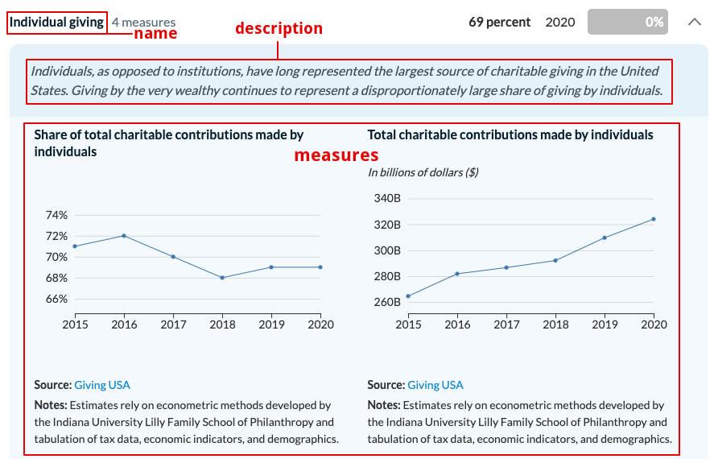
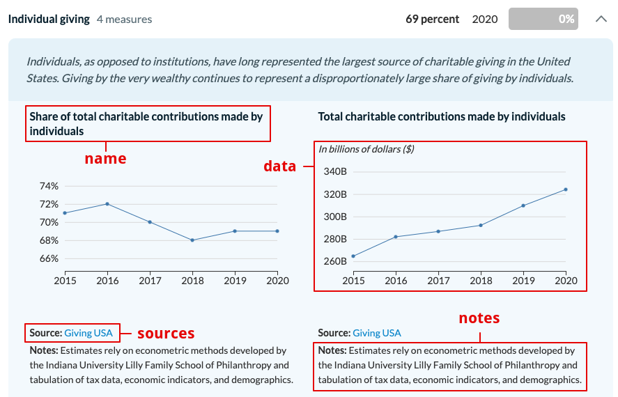
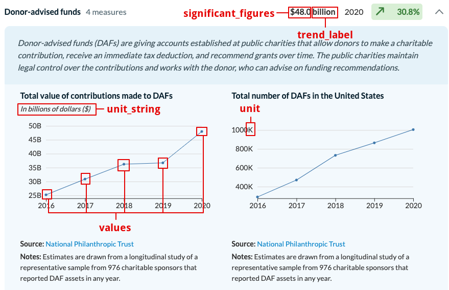

# Giving dashboard data file

All the data needed to create the dashboard is in the file `donations.json`. This includes all the information about the indicators, measures, and data points. In order to edit or add any data, you just need to modify this file accordingly following the guidelines described below.

## Indicators

The `donations.json` file is an array of objects, and each one of those objects represents an indicator.

```
[
    {                              // indicator #1
        "name": "",
        "description": "",
        "measures": [
            {},                    // measure #1
            {}                     // measure #2
        ]
    },
    {                              // indicator #2
        "name": "",
        "description": "",
        "measures": [
            {},                    // measure #1
            {},                    // measure #2
            {}                     // measure #3
        ]
    }
]
```

For each indicator we need to specify the following fields:

- `name`: (string) Name of the indicator

- `description`: (string) Summary or description of the indicator

- `measures`: (array of objects) Array of measures that will be displayed as line charts. The first measure in the array (leading measure) will be the highlighted one.




## Measures

Each measure has the following fields:

```
{                                     // measure # 1
    "name": "",
    "data": {},
    "sources": [
        {                             // source #1
            "source": "",
            "source_url": ""
        },
        {                             // source #2
            "source": "",
            "source_url": ""
        }
    ],
    "notes": ""
}
```

- `name`: (string) Name of the measure

- `data`: (object) Object as described below

- `sources`: (array of objects) Array containing the source name and source links

  - `source`: (string) Name of the source

  - `source_url`: (string) Link to source

- `notes`: (string) Additional notes e.g. regarding data.



## Data

Each data object needs the following fields:

```
"data": {
    "unit": "",
    "unit_string": "",
    "trend_label": "",
    "date_format": "",
    "significant_figures": "",
    "values": [
        {                            // data point #1
            "date": "",
            "value": ""
        },
        {                            // data point #2
            "date": "",
            "value": ""
        }
    ]
}
```

- `unit`: (string) Unit of the y-axis

- `unit_string`: (string) Label for the y-axis

- `trend_label`: (string) Label used in the trend displayed on the right side of the indicator

- `date_format`: (string) Format used to parse dates specified in the values. The most common cases are `%Y` for 4-digit years, and `%b %Y` for 3-letter month and 4-digit years. For more details visit the [d3-time-format documentation](https://github.com/d3/d3-time-format)

- `significant_figures`: (string) How many numbers are used for displaying the approximated values in the trend

- `values`: (array of objects) Array of data points to be plotted. If you need to inclued a new data point, this is where it needs to be added.

  - `date`: (string) Date for the data point. This needs to be consistent with the `date_format` specified above.

  - `value`: (string) Actual value of the data point.



## Trends

The trends are automatically calcualted based on the data and don't need to be specified in the data file.
